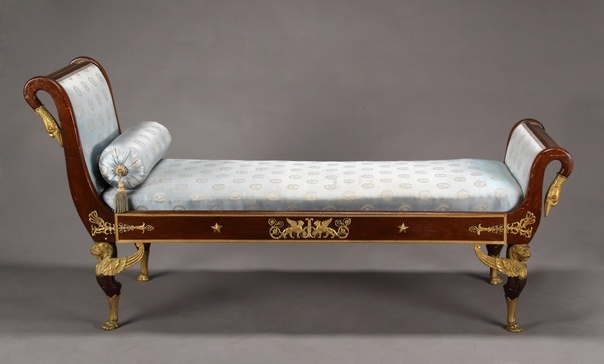
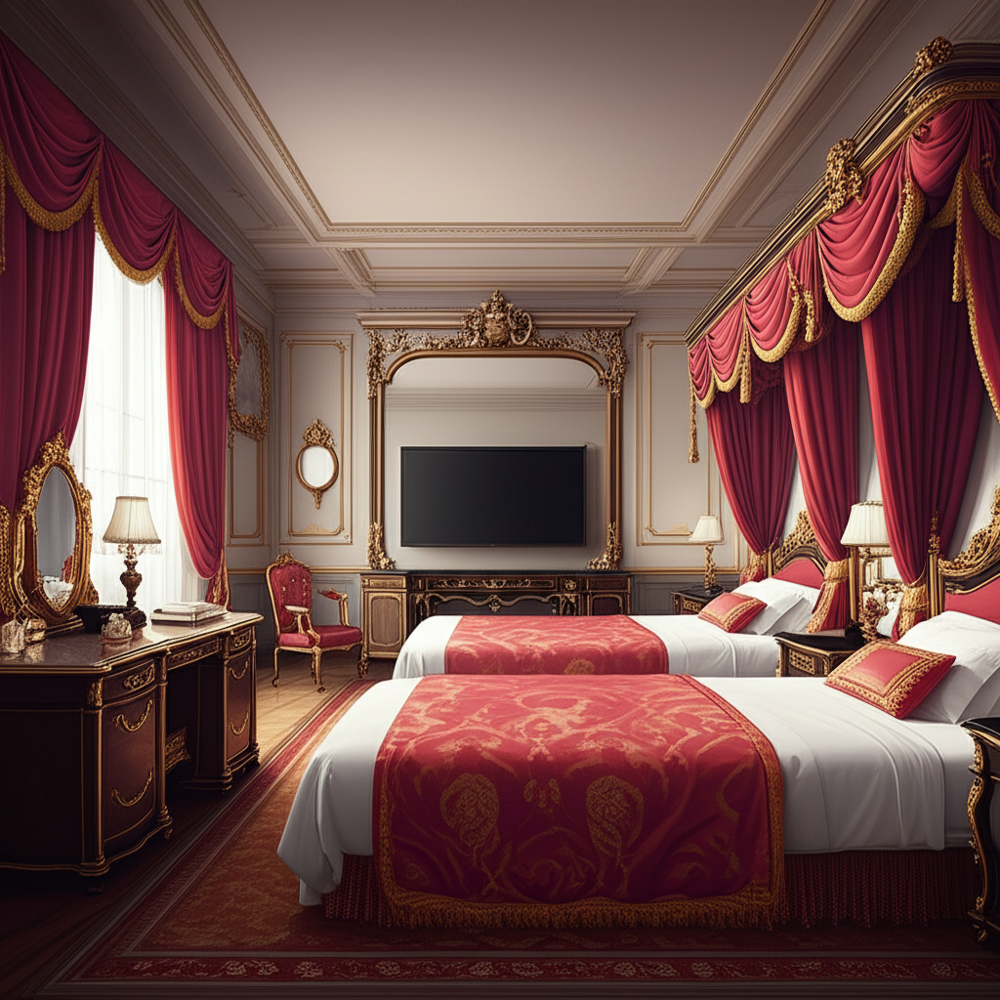
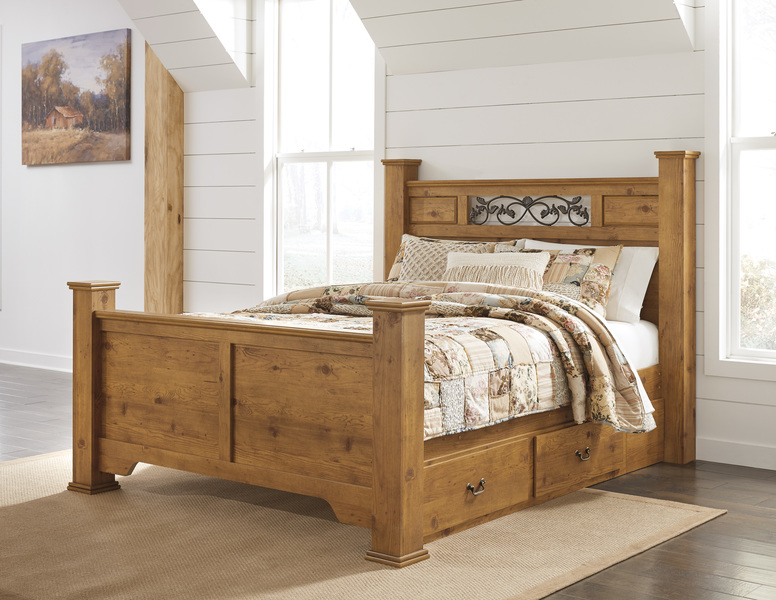
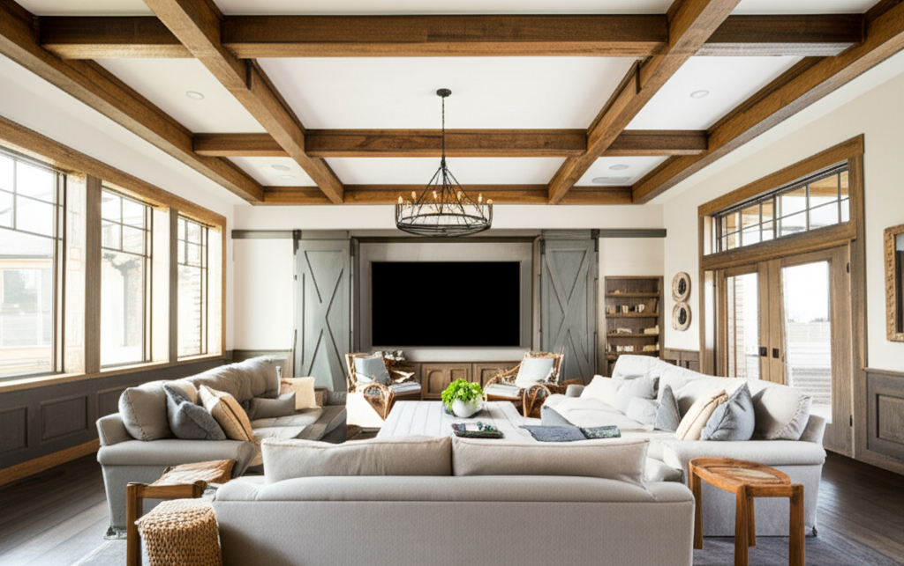

# Interior Generator

Задание: по референс‑картинке мебели и текстовому описанию комнаты нужно  
1) **Выделить стиль** мебели в виде текста;  
2) **Сгенерировать интерьер** в том же стиле на основе текстового описания комнаты;  
3) Убедиться, что при фиксированном `seed` оба шага воспроизводимы (unit‑тест).

Задание реализовано на Python 3.12 с использованием Google Gemini API.

---

## Структура проекта

```text
├── input/                # исходные изображения мебели
├── output/               # результаты генерации
├── interior_generator.py # основной класс
├── main.py               # пример запуска
├── test_repeatability.py # pytest‑тест на детерминизм
├── requirements.txt
└── .env                  # переменные окружения
```

---

## Переменные окружения

Укажите в `.env` переменные окружения:

```dotenv
GEMINI_API_KEY=YOUR_API_KEY
# при необходимости:
PROXY_HOST=proxy.example.com
PROXY_PORT=3128
PROXY_USER=user
PROXY_PASS=secret
```

---

## Запуск
Перед запуском возможно вам потребуется поставить proxy или VPN, так как модель `gemini-2.0-flash-preview-image-generation` недоступна при запросе с ряда IP-адресов (см. информацию по [ссылке](https://ai.google.dev/gemini-api/docs/models#gemini-2.0-flash-preview-image-generation)). (Я использовал US proxy)

Укажите в `main.py` при необходимости параметры `SEED`, `REF_IMAGE_PATH`, `ROOM_DESCRIPTION` и `OUTPUT_IMAGE_PATH`

```bash
pip install -r requirements.txt
# убедитесь, что .env заполнен
python main.py               # создаст output/imagename.png
pytest -q                    # запустит тест repeatability
```

---

## Реализация

| Шаг | Модель Gemini | Параметры |
|-----|---------------|-----------|
| Извлечение стиля    | `gemini-2.5-flash-preview-05-20`         | `temperature=0` |
| Генерация интерьера | `gemini-2.0-flash-preview-image-generation` | `temperature=0`, `seed=<фиксированный>` |

Детерминизм достигается фиксированным `seed` + нулевой температурой.  
`test_repeatability.py` сравнивает:

* выделенные **стили** (должны совпадать);
* pHash двух изображений (расстояние 0). Расстояние 0 выбрано так как требуется идентичность выходов (за исключением неразличимых на глаз деталей)

---

## Пример результата

| Вход |  Выделенный стиль  | Сгенерированный интерьер |
|---------------|--------------------------|---------------|
|   Room with tv on the wall, two beds and big mirror | Empire |  |
|   A lively entertainment room with a large screen and comfortable seating | Farmhouse |  |

---

## Затраченное время
**≈ 7 часов**
